# MLR-Bench System Architecture

## System Block Diagram

```mermaid
graph TB
    subgraph "User Interface [HTML/JS/CSS]"
        Browser["🌐 Web Browser<br/>[HTML/JS]"]
    end
    
    subgraph "UI Server [PY]"
        Flask["Flask Server<br/>[PY]<br/>Port: 5000"]
        SocketIO["SocketIO<br/>[WS]"]
        EventBusServer["Event Bus<br/>[PY]"]
    end
    
    subgraph "MLR-Bench Client [PY]"
        CLI["CLI Main<br/>[PY]"]
        MLRAgent["MLR Agent<br/>Orchestrator<br/>[PY]"]
        EventBusClient["Event Bus<br/>[PY]"]
        
        subgraph "Research Agents [PY]"
            IdeaGen["💡 Idea Generator<br/>[PY]"]
            LitReview["📚 Literature Reviewer<br/>[PY]"]
            ProposalWriter["📝 Proposal Writer<br/>[PY]"]
            Experimenter["🧪 Experimenter<br/>[PY]"]
            PaperWriter["📄 Paper Writer<br/>[PY]"]
        end
        
        subgraph "Judge System [PY]"
            MLRJudge["MLR Judge<br/>[PY]"]
            IdeaEval["Idea Evaluator<br/>[PY]"]
            PaperEval["Paper Evaluator<br/>[PY]"]
        end
        
        subgraph "Tools [PY]"
            SearchTool["🔍 search_papers<br/>[PY]"]
            ExecTool["⚙️ execute_code<br/>[PY]"]
            CalcTool["📊 calculate_score<br/>[PY]"]
            FileTool["💾 save_to_file<br/>[PY]"]
        end
    end
    
    subgraph "MCP Layer [MCP]"
        MCPClient["MCP Client<br/>[PY/MCP]"]
        SemanticScholar["Semantic Scholar<br/>API<br/>[MCP/HTTP]"]
        PythonExec["Python Executor<br/>Sandbox<br/>[MCP]"]
    end
    
    subgraph "External Services"
        Gemini["🤖 Google Gemini<br/>API<br/>[HTTP/JSON]"]
        Internet["🌐 Internet<br/>Academic Papers"]
    end
    
    subgraph "Data Storage [JSON]"
        Tasks["tasks.json<br/>[JSON]<br/>10 Research Tasks"]
        Results["results/<br/>[JSON/TXT]<br/>Output Files"]
        Workspace["workspaces/<br/>[TXT/PY]<br/>Agent Files"]
    end
    
    %% User Interface Connections
    Browser -->|"WebSocket [WS]"| SocketIO
    Browser -->|"HTTP GET [HTTP]"| Flask
    
    %% Server Internal
    Flask -->|"Python calls"| EventBusServer
    SocketIO -->|"Broadcast events"| Browser
    Flask -->|"Receive events<br/>POST /api/event [HTTP]"| EventBusServer
    
    %% Client to Server Communication
    EventBusClient -->|"HTTP POST [HTTP]<br/>Cross-Process IPC"| Flask
    
    %% Client Internal Flow
    CLI -->|"Initialize"| MLRAgent
    MLRAgent -->|"Orchestrate"| IdeaGen
    MLRAgent -->|"Orchestrate"| LitReview
    MLRAgent -->|"Orchestrate"| ProposalWriter
    MLRAgent -->|"Orchestrate"| Experimenter
    MLRAgent -->|"Orchestrate"| PaperWriter
    MLRAgent -->|"Evaluate"| MLRJudge
    
    %% Event Tracking
    IdeaGen -.->|"Emit events"| EventBusClient
    LitReview -.->|"Emit events"| EventBusClient
    ProposalWriter -.->|"Emit events"| EventBusClient
    Experimenter -.->|"Emit events"| EventBusClient
    PaperWriter -.->|"Emit events"| EventBusClient
    
    %% Agents to Tools
    IdeaGen -->|"Use tools"| SearchTool
    LitReview -->|"Use tools"| SearchTool
    Experimenter -->|"Use tools"| ExecTool
    Experimenter -->|"Use tools"| FileTool
    MLRJudge -->|"Use tools"| CalcTool
    
    %% Tools to MCP
    SearchTool -->|"MCP call"| MCPClient
    ExecTool -->|"MCP call"| MCPClient
    
    %% MCP to External
    MCPClient -->|"MCP Protocol"| SemanticScholar
    MCPClient -->|"MCP Protocol"| PythonExec
    SemanticScholar -->|"HTTP API"| Internet
    
    %% Agents to Gemini
    IdeaGen -->|"API calls<br/>[HTTP/JSON]"| Gemini
    LitReview -->|"API calls<br/>[HTTP/JSON]"| Gemini
    ProposalWriter -->|"API calls<br/>[HTTP/JSON]"| Gemini
    Experimenter -->|"API calls<br/>[HTTP/JSON]"| Gemini
    PaperWriter -->|"API calls<br/>[HTTP/JSON]"| Gemini
    IdeaEval -->|"API calls<br/>[HTTP/JSON]"| Gemini
    PaperEval -->|"API calls<br/>[HTTP/JSON]"| Gemini
    
    %% Data Access
    CLI -->|"Load [JSON]"| Tasks
    MLRAgent -->|"Save [JSON/TXT]"| Results
    Experimenter -->|"Read/Write [TXT/PY]"| Workspace
    
    style Browser fill:#e1f5ff
    style Flask fill:#fff4e6
    style MLRAgent fill:#f3e5f5
    style Gemini fill:#e8f5e9
    style Tasks fill:#fff9c4
    style EventBusClient fill:#ffebee
    style EventBusServer fill:#ffebee
```

---

## 100-Word Summary: Data Flow and Communication Protocols

MLR-Bench uses a **multi-process architecture** with **HTTP** and **WebSocket** for inter-process communication. The **Client [PY]** runs research agents that communicate with **Google Gemini [HTTP/JSON]** for LLM inference. Agents emit events to **Event Bus [PY]**, which sends them via **HTTP POST** to the **UI Server [PY]**. The server broadcasts events to the **Browser [JS]** via **WebSocket [WS]**. Tools use **MCP (Model Context Protocol)** to access external services like **Semantic Scholar [HTTP]** for paper search. All data is stored in **JSON/TXT** files. Port **5000** handles all HTTP/WebSocket traffic.

---

## Detailed Component Explanation

### 1. User Interface Layer

#### 🌐 Web Browser **[HTML/JS/CSS]**
- **Technology:** HTML5, JavaScript (Vanilla), CSS3
- **File:** `mlr_bench/ui/templates/index.html`, `mlr_bench/ui/static/js/app.js`, `mlr_bench/ui/static/css/style.css`
- **Purpose:** Real-time visualization of agent orchestration
- **Features:**
  - Pipeline visualization (5 stages)
  - Event log with color-coded entries
  - Server/Client status indicators
  - WebSocket connection for live updates
- **Communication:** 
  - Receives events via **WebSocket [WS]** on port 5000
  - Sends HTTP GET requests for initial data

---

### 2. UI Server **[PY]**

#### Flask Server **[PY]**
- **Technology:** Python 3.11+, Flask 3.0+
- **File:** `mlr_bench/ui/server.py`
- **Port:** 5000 (HTTP + WebSocket)
- **Endpoints:**
  - `GET /` - Serve HTML page
  - `GET /api/events` - Get event history **[HTTP/JSON]**
  - `POST /api/event` - Receive events from client **[HTTP/JSON]**
  - `POST /api/clear` - Clear event log
- **Purpose:** Bridge between client and browser

#### SocketIO **[WS]**
- **Technology:** Flask-SocketIO (WebSocket)
- **Protocol:** WebSocket over port 5000
- **Purpose:** Real-time bidirectional communication with browser
- **Events:**
  - `connect` - Client connected
  - `disconnect` - Client disconnected
  - `agent_event` - Broadcast agent activity

#### Event Bus (Server) **[PY]**
- **Technology:** Python Singleton pattern
- **File:** `mlr_bench/ui/event_bus.py`
- **Purpose:** Collect and store events from client
- **Storage:** In-memory list of `AgentEvent` objects

---

### 3. MLR-Bench Client **[PY]**

#### CLI Main **[PY]**
- **Technology:** Python 3.11+, argparse
- **File:** `mlr_bench/cli/main.py`
- **Purpose:** Command-line interface
- **Commands:**
  - `mlr-bench --task-id <id>` - Run single task
  - `mlr-bench --all` - Run all tasks
  - `mlr-bench --list-tasks` - List available tasks

#### MLR Agent Orchestrator **[PY]**
- **Technology:** Python async/await
- **File:** `mlr_bench/agent/mlr_agent.py`
- **Purpose:** Orchestrate the 5-stage research pipeline
- **Pipeline:**
  1. Idea Generation
  2. Literature Review
  3. Proposal Writing
  4. Experimentation
  5. Paper Writing
- **Data Flow:** Sequential (output of stage N → input of stage N+1)

#### Event Bus (Client) **[PY]**
- **Technology:** Python Singleton + HTTP client (requests)
- **File:** `mlr_bench/ui/event_bus.py`
- **Purpose:** Emit events to UI server
- **Communication:** HTTP POST to `http://localhost:5000/api/event` **[HTTP/JSON]**
- **Cross-Process:** Uses HTTP for inter-process communication (IPC)

---

### 4. Research Agents **[PY]**

All agents use **Google ADK (Agent Development Kit)** framework.

#### 💡 Idea Generator **[PY]**
- **File:** `mlr_bench/agent/stages/idea_generator.py`
- **Input:** Task description **[JSON]**
- **Output:** ResearchIdea **[JSON]**
- **LLM:** Google Gemini 2.0 Flash **[HTTP/JSON]**
- **Tools:** search_papers (optional)
- **Purpose:** Generate novel research ideas

#### 📚 Literature Reviewer **[PY]**
- **File:** `mlr_bench/agent/stages/literature_reviewer.py`
- **Input:** ResearchIdea **[JSON]**
- **Output:** LiteratureReview **[JSON]**
- **LLM:** Google Gemini 2.0 Flash **[HTTP/JSON]**
- **Tools:** search_papers (via MCP)
- **Purpose:** Search and review related academic papers

#### 📝 Proposal Writer **[PY]**
- **File:** `mlr_bench/agent/stages/proposal_writer.py`
- **Input:** ResearchIdea + LiteratureReview **[JSON]**
- **Output:** ResearchProposal **[JSON]**
- **LLM:** Google Gemini 2.0 Flash **[HTTP/JSON]**
- **Purpose:** Write detailed research proposal with methodology

#### 🧪 Experimenter **[PY]**
- **File:** `mlr_bench/agent/stages/experimenter.py`
- **Input:** ResearchProposal **[JSON]**
- **Output:** ExperimentResult **[JSON]**
- **LLM:** Google Gemini 2.0 Flash **[HTTP/JSON]**
- **Tools:** execute_code (via MCP), save_to_file
- **Purpose:** Implement and run experiments (mock in current version)

#### 📄 Paper Writer **[PY]**
- **File:** `mlr_bench/agent/stages/paper_writer.py`
- **Input:** All previous outputs **[JSON]**
- **Output:** ResearchPaper **[JSON/TXT]**
- **LLM:** Google Gemini 2.0 Flash **[HTTP/JSON]**
- **Purpose:** Write complete research paper

---

### 5. Judge System **[PY]**

#### MLR Judge **[PY]**
- **File:** `mlr_bench/judge/mlr_judge.py`
- **Purpose:** Evaluate research outputs
- **Evaluators:** IdeaEvaluator, PaperEvaluator

#### Idea Evaluator **[PY]**
- **File:** `mlr_bench/judge/evaluators/idea_evaluator.py`
- **Input:** ResearchIdea **[JSON]**
- **Output:** EvaluationResult **[JSON]**
- **LLM:** Google Gemini 2.0 Flash **[HTTP/JSON]**
- **Scores:** Consistency, Clarity, Novelty, Feasibility, Significance (0-10)

#### Paper Evaluator **[PY]**
- **File:** `mlr_bench/judge/evaluators/paper_evaluator.py`
- **Input:** ResearchPaper **[JSON]**
- **Output:** EvaluationResult **[JSON]**
- **LLM:** Google Gemini 2.0 Flash **[HTTP/JSON]**
- **Scores:** Soundness, Clarity, Significance (0-10)

---

### 6. Tools **[PY]**

#### 🔍 search_papers **[PY]**
- **File:** `mlr_bench/agent/tools.py`
- **Technology:** Python function
- **Purpose:** Search academic papers
- **Backend:** Semantic Scholar API via MCP **[MCP/HTTP]**
- **Input:** Query string
- **Output:** List of papers **[JSON]**

#### ⚙️ execute_code **[PY]**
- **File:** `mlr_bench/agent/tools.py`
- **Technology:** Python function
- **Purpose:** Execute Python code in sandbox
- **Backend:** Python Executor via MCP **[MCP]**
- **Input:** Python code **[TXT]**
- **Output:** Execution result **[TXT]**

#### 📊 calculate_score **[PY]**
- **File:** `mlr_bench/agent/tools.py`
- **Technology:** Pure Python function
- **Purpose:** Calculate average scores
- **Input:** List of numbers
- **Output:** Average **[FLOAT]**

#### 💾 save_to_file **[PY]**
- **File:** `mlr_bench/agent/tools.py`
- **Technology:** Pure Python function
- **Purpose:** Save content to file
- **Input:** Path, content **[TXT]**
- **Output:** File written to disk

---

### 7. MCP Layer **[MCP]**

#### MCP Client **[PY/MCP]**
- **File:** `mlr_bench/mcp/mcp_client.py`
- **Technology:** Model Context Protocol (MCP)
- **Purpose:** Connect to external MCP servers
- **Servers:**
  - `semantic_scholar` - Paper search
  - `python_executor` - Code execution

#### Semantic Scholar API **[MCP/HTTP]**
- **File:** `mlr_bench/mcp/mcp_tools.py`
- **Technology:** MCP wrapper around HTTP API
- **Endpoint:** `https://api.semanticscholar.org/graph/v1/paper/search`
- **Protocol:** HTTP GET with JSON response **[HTTP/JSON]**
- **Rate Limit:** Free tier (no API key required)

#### Python Executor Sandbox **[MCP]**
- **File:** `mlr_bench/mcp/mcp_tools.py`
- **Technology:** MCP wrapper around subprocess
- **Purpose:** Execute Python code safely
- **Security:** Sandboxed environment (mock in current version)

---

### 8. External Services

#### 🤖 Google Gemini API **[HTTP/JSON]**
- **Technology:** REST API over HTTPS
- **Model:** `gemini-2.0-flash-exp`
- **Authentication:** API Key (GOOGLE_API_KEY environment variable)
- **Endpoint:** `https://generativelanguage.googleapis.com/v1beta/models/gemini-2.0-flash-exp:generateContent`
- **Protocol:** HTTP POST with JSON payload **[HTTP/JSON]**
- **Usage:** All agents and evaluators use Gemini for LLM inference

#### 🌐 Internet / Academic Papers
- **Access:** Via Semantic Scholar API
- **Content:** Academic papers, abstracts, citations
- **Format:** JSON responses **[JSON]**

---

### 9. Data Storage **[JSON/TXT]**

#### tasks.json **[JSON]**
- **File:** `data/tasks/tasks.json`
- **Content:** 10 research tasks from Table 7 of the paper
- **Format:** JSON array of Task objects
- **Fields:** task_id, name, topic, category, description

#### results/ **[JSON/TXT]**
- **Directory:** `results/<task_id>/`
- **Files:**
  - `idea.json` - Generated research idea
  - `literature.json` - Literature review
  - `proposal.json` - Research proposal
  - `experiment.json` - Experiment results
  - `paper.txt` - Final research paper
  - `evaluation.json` - Evaluation scores

#### workspaces/ **[TXT/PY]**
- **Directory:** `workspaces/<task_id>/`
- **Files:** Agent working files (code, data, intermediate results)
- **Format:** Text files, Python scripts

---

## Communication Protocols

### 1. HTTP **[HTTP]**
- **Port:** 5000
- **Usage:**
  - Client → Server: POST `/api/event` (send events)
  - Browser → Server: GET `/api/events` (fetch history)
  - Browser → Server: GET `/` (load UI)
- **Format:** JSON payloads

### 2. WebSocket **[WS]**
- **Port:** 5000 (same as HTTP, upgraded connection)
- **Usage:** Server → Browser (real-time event broadcasting)
- **Events:** `agent_event`, `connected`, `disconnect`
- **Format:** JSON messages

### 3. MCP (Model Context Protocol) **[MCP]**
- **Usage:** Tools → External Services
- **Servers:**
  - Semantic Scholar (paper search)
  - Python Executor (code execution)
- **Format:** MCP-specific protocol (abstracted by MCP client)

### 4. Google AI API **[HTTP/JSON]**
- **Protocol:** HTTPS REST API
- **Authentication:** Bearer token (API key)
- **Format:** JSON request/response
- **Usage:** All LLM inference calls

---

## Data Flow Example

**Scenario:** User runs `mlr-bench --task-id iclr2025_bi_align`

1. **CLI [PY]** loads task from `tasks.json` **[JSON]**
2. **MLRAgent [PY]** starts pipeline
3. **IdeaGenerator [PY]** emits "started" event
4. **Event Bus (Client) [PY]** sends HTTP POST to UI Server **[HTTP/JSON]**
5. **Flask Server [PY]** receives event, stores in Event Bus (Server)
6. **SocketIO [WS]** broadcasts event to Browser
7. **Browser [JS]** updates GUI (stage turns green)
8. **IdeaGenerator [PY]** calls Gemini API **[HTTP/JSON]**
9. **Gemini** returns generated idea **[JSON]**
10. **IdeaGenerator [PY]** emits "completed" event with output
11. Event flows back to GUI (steps 4-7)
12. **MLRAgent [PY]** passes idea to **LiteratureReviewer [PY]**
13. **LiteratureReviewer [PY]** calls `search_papers` tool
14. **search_papers [PY]** calls **MCP Client [MCP]**
15. **MCP Client [MCP]** queries **Semantic Scholar API [HTTP]**
16. Papers returned, passed to Gemini for review
17. Process repeats for all 5 stages
18. Final paper saved to `results/` **[TXT/JSON]**

---

## Technology Stack Summary

| Component | Languages/Technologies |
|-----------|----------------------|
| **UI** | HTML5, JavaScript (Vanilla), CSS3 |
| **Server** | Python 3.11+, Flask 3.0+, Flask-SocketIO |
| **Client** | Python 3.11+, Google ADK, asyncio |
| **Agents** | Python 3.11+, Google ADK, Pydantic |
| **LLM** | Google Gemini 2.0 Flash (via HTTP API) |
| **Tools** | Python functions, MCP protocol |
| **Data** | JSON, TXT, Markdown |
| **Protocols** | HTTP, WebSocket, MCP |
| **Port** | 5000 (HTTP + WebSocket) |

---

## Security & Privacy

- **API Keys:** Stored in `.env` file (not uploaded to GitHub)
- **Sandboxing:** Code execution is sandboxed (mock in current version)
- **CORS:** Enabled for localhost development
- **No Authentication:** Educational tool, not for production

---

## Educational Focus

This architecture demonstrates:
- ✅ **Multi-agent orchestration** (5 sequential agents)
- ✅ **Inter-process communication** (HTTP + WebSocket)
- ✅ **Event-driven architecture** (Event Bus pattern)
- ✅ **Tool usage** (search, code execution, calculations)
- ✅ **LLM integration** (Google Gemini API)
- ✅ **Real-time visualization** (WebSocket updates)
- ✅ **MCP protocol** (external service integration)

The focus is on **learning orchestration mechanics** rather than achieving high-quality research outputs.

---

**For more details, see:**
- [README.md](README.md) - Installation and usage
- [QUICKSTART.md](QUICKSTART.md) - Quick start guide
- [CONTRIBUTING.md](CONTRIBUTING.md) - Development guidelines
