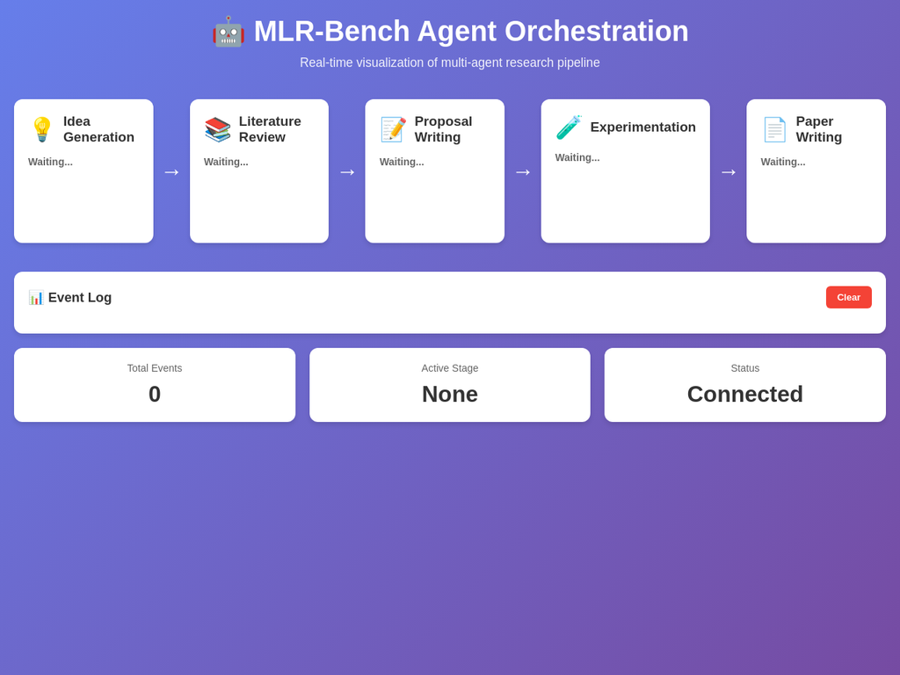

# MLR-Bench: Machine Learning Research Benchmark

**Educational Implementation for Teaching Multi-Agent Orchestration**

## Credits and Attribution

### Original Research Paper
This implementation is based on the research paper:

**"Evaluating AI Agents on Open-Ended Machine Learning Research"**

**Paper Link:** https://arxiv.org/abs/2505.19955

**Original Authors:**
- Chenhui Zhang (Lead Author)
- And colleagues from the original research team

**Original Repository:** https://github.com/chchenhui/mlrbench

### Educational Implementation
**All rights reserved to Dr. Yoram Segal**

This code is developed for **educational purposes only** to teach:
- Multi-agent orchestration
- Agent communication protocols
- Agent instruction design
- Tool usage in agent systems

The focus is on learning the orchestration mechanics rather than achieving high-quality research outputs.

---

## Overview

MLR-Bench is a benchmark system for evaluating AI agents on open-ended machine learning research tasks. This educational implementation uses **Google AI Agent Development Kit (ADK)** to demonstrate multi-agent collaboration through a complete research pipeline.

### Research Pipeline Stages

1. **Idea Generation** - Generate novel research ideas
2. **Literature Review** - Review related work
3. **Proposal Writing** - Write detailed research proposals
4. **Experimentation** - Implement and run experiments
5. **Paper Writing** - Write complete research papers
6. **Evaluation** - Multi-judge evaluation system

### Key Features

- ✅ **10 Trustworthy AI Tasks** from Table 7 of the original paper
- ✅ **Google ADK Integration** for agent orchestration
- ✅ **Multi-Agent Architecture** with specialized agents per stage
- ✅ **Multi-LLM Judge System** for evaluation
- ✅ **Simplified Implementation** (<300 lines per file)
- ✅ **Educational Focus** on orchestration, not output quality

---

## Installation

### Prerequisites

- Python 3.11+
- Google AI API Key (get from [Google AI Studio](https://aistudio.google.com/))

### Setup

```bash
# Clone the repository
git clone <your-repo-url>
cd mlr-bench

# Create virtual environment
python -m venv .venv
source .venv/bin/activate  # On Windows: .venv\Scripts\activate

# Install dependencies
pip install -r requirements.txt

# Configure environment
cp .env.example .env
# Edit .env and add your GOOGLE_API_KEY
```

### Environment Variables

Create a `.env` file:

```bash
# Required
GOOGLE_API_KEY=your_api_key_here
GOOGLE_GENAI_USE_VERTEXAI=FALSE

# Optional
MODEL_NAME=gemini-2.0-flash
TEMPERATURE=0.7
LOG_LEVEL=INFO
```

---

## Visualization UI

MLR-Bench includes a **real-time web-based visualization** that shows the agent orchestration in action.



### Starting the Visualization Server

**Terminal 1 - Start UI Server:**
```bash
source .venv/bin/activate
python -m mlr_bench.cli.ui_server
```

The server will start on `http://localhost:5000`

**Terminal 2 - Run MLR-Bench:**
```bash
source .venv/bin/activate
mlr-bench --task-id iclr2025_bi_align
```

Open your browser at `http://localhost:5000` to see real-time updates!

### UI Components

#### 1. Pipeline Visualization (Top Section)
Five connected stages showing the research pipeline:

- **💡 Idea Generation** - Generates novel research ideas
- **📚 Literature Review** - Reviews related academic papers
- **📝 Proposal Writing** - Writes detailed research proposals
- **🧪 Experimentation** - Implements and runs experiments
- **📄 Paper Writing** - Writes the final research paper

**Stage Colors:**
- **White background** - Waiting (not started yet)
- **Green border + scale effect** - Currently active/running
- **Light green background** - Completed successfully
- **Light red background** - Error occurred

#### 2. Stage Status Indicators
Each stage shows:
- **🟢 Running...** - Agent is currently processing (green text)
- **✅ Completed** - Stage finished successfully (green text)
- **❌ Error** - Stage encountered an error (red text)
- **Waiting...** - Stage hasn't started yet (gray text)

#### 3. Input/Output Display
Below each stage status, you'll see:
- **Input:** What data the agent received (truncated to 100 chars)
- **Output:** What the agent produced (truncated to 100 chars)

This shows the **data flow between agents** in real-time.

#### 4. Event Log (Middle Section)
A chronological log of all agent activities:
- **Blue border** - Agent started
- **Green border** - Agent completed
- **Red border** - Error occurred

Each entry shows:
- Timestamp
- Agent name
- Stage name
- Event type

The log auto-scrolls and keeps the last 50 events.

#### 5. Statistics (Bottom Section)
Three key metrics:

- **Total Events** - Number of events since start
- **Active Stage** - Which stage is currently running
- **Status** - Overall system status (Connected/Idle/Running)

### UI Features

✅ **Real-time Updates** - WebSocket connection for instant updates  
✅ **Color-Coded Status** - Easy visual identification of agent states  
✅ **Data Flow Visualization** - See inputs/outputs between agents  
✅ **Event History** - Complete log of all activities  
✅ **Clear Button** - Reset the visualization  
✅ **Responsive Design** - Works on desktop and mobile  

### Understanding the Orchestration

The UI helps you understand:

1. **Sequential Flow** - Agents execute in order (Idea → Literature → Proposal → Experiment → Paper)
2. **Data Passing** - Each agent receives output from previous agents
3. **Real-time Processing** - See exactly when each agent starts/stops
4. **Error Handling** - Immediately see if any stage fails
5. **Timing** - Understand how long each stage takes

### Troubleshooting UI

**Port 5000 already in use:**
```bash
python -m mlr_bench.cli.ui_server --port 5001
```

**UI not updating:**
- Check that WebSocket connection shows "Connected" in statistics
- Refresh the browser page
- Check browser console for errors (F12)

**Server not starting:**
```bash
pip install flask flask-socketio aiohttp
```

---

## Usage

### Run Single Task

```bash
mlr-bench --task-id iclr2025_bi_align
```

### Run All Tasks

```bash
mlr-bench --all
```

### Available Tasks (Table 7)

| Task ID | Topic | Category |
|---------|-------|----------|
| `iclr2025_bi_align` | Bidirectional Human-AI Alignment | Trustworthy AI |
| `iclr2025_buildingtrust` | Building Trust in Language Models | Trustworthy AI |
| `iclr2025_data_problems` | Data Problems for Foundation Models | Trustworthy AI |
| `iclr2025_dl4c` | Deep Learning for Code | LLM/VLM |
| `iclr2025_mldpr` | ML Data Practices and Repositories | Trustworthy AI |
| `iclr2025_question` | Uncertainty and Hallucination | LLM/VLM |
| `iclr2025_scope` | Scalable Optimization | Trustworthy AI |
| `iclr2025_scsl` | Spurious Correlation | Trustworthy AI |
| `iclr2025_verifai` | AI Verification | Trustworthy AI |
| `iclr2025_wsl` | Neural Network Weights | ML Theory |

---

## Architecture

### Agent System

```
MLRAgent (Orchestrator)
├── IdeaGenerator
├── LiteratureReviewer
├── ProposalWriter
├── Experimenter
└── PaperWriter
```

Each agent is implemented using **Google ADK** with:
- Specialized instructions
- Tool access
- Async communication

### Judge System

```
MLRJudge
├── IdeaEvaluator (multi-judge)
└── PaperEvaluator (multi-judge)
```

Evaluation rubrics:
- **Ideas**: Consistency, Clarity, Novelty, Feasibility, Significance
- **Papers**: Clarity, Novelty, Soundness, Significance

### Data Flow

```
Task → Agent Pipeline → Research Paper
                    ↓
              Judge System → Evaluation
```

---

## Project Structure

```
mlr-bench/
├── mlr_bench/
│   ├── agent/
│   │   ├── mlr_agent.py          # Main orchestrator
│   │   └── stages/               # Stage-specific agents
│   │       ├── idea_generator.py
│   │       ├── literature_reviewer.py
│   │       ├── proposal_writer.py
│   │       ├── experimenter.py
│   │       └── paper_writer.py
│   ├── judge/
│   │   ├── mlr_judge.py          # Multi-LLM judge
│   │   └── evaluators/
│   │       ├── idea_evaluator.py
│   │       └── paper_evaluator.py
│   ├── models/                   # Pydantic data models
│   ├── tasks/                    # Task management
│   ├── config/                   # Configuration & prompts
│   ├── utils/                    # Utilities
│   └── cli/                      # Command-line interface
├── data/
│   └── tasks/
│       └── tasks.json            # 10 tasks from Table 7
├── results/                      # Output directory
├── workspaces/                   # Experiment workspaces
└── tests/                        # Test suite
```

---

## Full Dataset

The original MLR-Bench contains **201 research tasks** across multiple categories:
- LLM/VLM
- AI for Science
- Multimodal
- Reinforcement Learning
- Computer Vision
- NLP
- ML Theory

**Download the full dataset:** https://github.com/chchenhui/mlrbench

This educational implementation uses 10 selected tasks from Table 7 for practical demonstration.

---

## Development

### Running Tests

```bash
pytest tests/
```

### Code Style

- Maximum 300 lines per file
- Simple, readable code for students
- Extensive comments
- Type hints

---

## Educational Goals

This implementation teaches:

1. **Multi-Agent Orchestration**
   - Sequential agent execution
   - Data passing between agents
   - State management

2. **Communication Protocols**
   - Structured data models (Pydantic)
   - JSON serialization
   - Async communication

3. **Agent Design**
   - Specialized instructions
   - Tool integration
   - Error handling

4. **Evaluation Systems**
   - Multi-judge consensus
   - Rubric-based scoring
   - Result aggregation

---

## Limitations

⚠️ **This is an educational implementation:**

- Simplified experiment execution (no actual code running)
- Basic literature review (no real paper search)
- Focus on orchestration, not research quality
- Uses accessible models (Gemini Flash)

For production research, see the original repository.

---

## License

**All rights reserved to Dr. Yoram Segal**

This code is for educational purposes only.

Original research and benchmark © Original Authors

---

## Citation

If you use this educational implementation, please cite the original paper:

```bibtex
@article{mlrbench2024,
  title={Evaluating AI Agents on Open-Ended Machine Learning Research},
  author={Zhang, Chenhui and others},
  year={2024}
}
```

---

## Support

For questions about this educational implementation, please open an issue.

For the original research and full benchmark, visit: https://github.com/chchenhui/mlrbench
