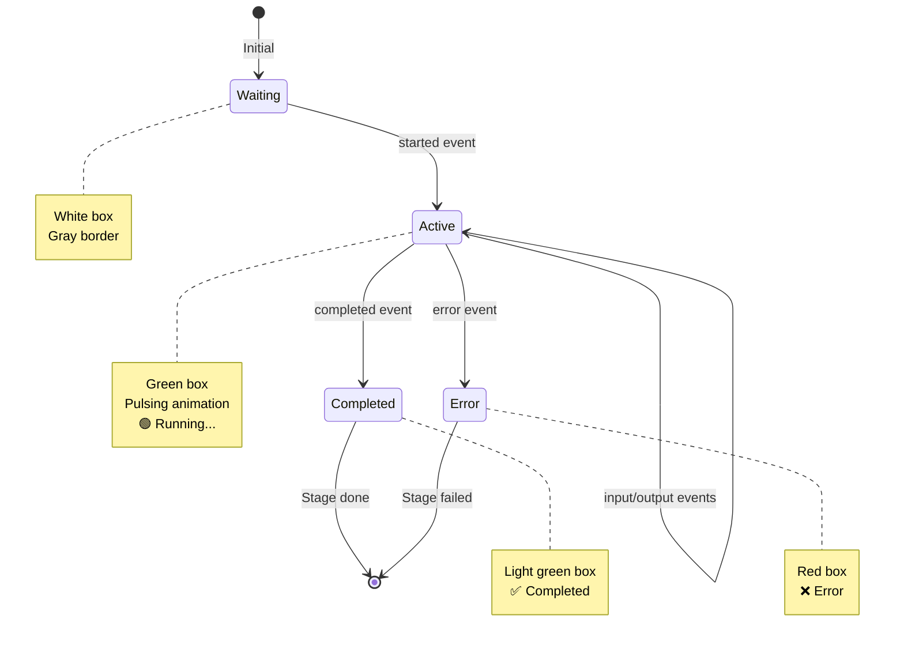

# MLR-Bench System States and Events

**Complete reference for all system states, events, and agent activities**

---

## Table of Contents

1. [Event Types](#1-event-types)
2. [Research Stages](#2-research-stages)
3. [Stage Status](#3-stage-status)
4. [System Status](#4-system-status)
5. [Event Flow](#5-event-flow)
6. [Stage Participants](#6-stage-participants)
7. [Known Issues](#7-known-issues)

---

## 1. Event Types

**Description:** Types of events emitted by agents during execution

| Event Type | Description | When Triggered | GUI Color | GUI Icon |
|------------|-------------|----------------|-----------|----------|
| **started** | Agent started working | At the beginning of each stage | 🟢 Green | 🟢 Running... |
| **input** | Display input received by agent | After started | - | Input: ... |
| **output** | Display output produced by agent | Before completed | - | Output: ... |
| **completed** | Agent finished successfully | At the end of stage | 🟢 Light Green | ✅ Completed |
| **error** | Agent failed | In case of error | 🔴 Red | ❌ Error |

**Implementation:**
- File: `mlr_bench/agent/agent_wrapper.py`
- Decorator: `@track_agent_execution(agent_name, stage)`
- Event Bus: `mlr_bench/ui/event_bus.py`

**Example Event:**
```json
{
  "agent_name": "IdeaGenerator",
  "stage": "idea",
  "event_type": "started",
  "data": {},
  "timestamp": "2025-10-07T12:00:00"
}
```

---

## 2. Research Stages

**Description:** Sequential stages in the research pipeline

| Stage ID | Stage Name | Agent | Input | Output | Duration |
|----------|------------|-------|-------|--------|----------|
| **idea** | Idea Generation | IdeaGenerator | Task | ResearchIdea | ~10-30s |
| **literature** | Literature Review | LiteratureReviewer | ResearchIdea | LiteratureReview | ~30-60s |
| **proposal** | Proposal Writing | ProposalWriter | Idea + Literature | ResearchProposal | ~30-60s |
| **experiment** | Experimentation | Experimenter | Proposal | ExperimentResult | ~60-120s |
| **paper** | Paper Writing | PaperWriter | All previous | ResearchPaper | ~60-120s |
| **evaluation** ⚠️ | Evaluation | MLRJudge | ResearchPaper | EvaluationResult | ~30-60s |

⚠️ **Known Issue:** The `evaluation` stage is **currently missing from the GUI** (see [Known Issues](#7-known-issues))

**Total Pipeline Duration:** ~3-6 minutes per task

**Stage Files:**
- `mlr_bench/agent/stages/idea_generator.py`
- `mlr_bench/agent/stages/literature_reviewer.py`
- `mlr_bench/agent/stages/proposal_writer.py`
- `mlr_bench/agent/stages/experimenter.py`
- `mlr_bench/agent/stages/paper_writer.py`
- `mlr_bench/judge/mlr_judge.py` (evaluation)

---

## 3. Stage Status

**Description:** Visual states of each stage in the GUI

| Status Class | Description | CSS Class | Background Color | Border Color | When Applied |
|--------------|-------------|-----------|------------------|--------------|--------------|
| **waiting** | Waiting (not started yet) | (default) | White (#fff) | Gray (#ddd) | Initial state |
| **active** | Active (currently running) | `.active` | Light Green (#e8f5e9) | Dark Green (#4CAF50) | Event: started |
| **completed** | Completed successfully | `.completed` | Light Green (#e8f5e9) | Green (#4CAF50) | Event: completed |
| **error** | Failed with error | `.error` | Light Red (#ffebee) | Red (#f44336) | Event: error |

**CSS Implementation:**
- File: `mlr_bench/ui/static/css/style.css`
- Classes: `.stage-box`, `.stage-box.active`, `.stage-box.completed`, `.stage-box.error`

**Visual Indicators:**

```
⚪ Waiting    → White box, gray border
🟢 Active    → Light green box, green border, pulsing animation
✅ Completed → Light green box, green border, checkmark
❌ Error     → Light red box, red border, X mark
```

---

## 4. System Status

**Description:** Connection and activity status of system components

### 4.1 Server Status

| Status | Description | Indicator | WebSocket State |
|--------|-------------|-----------|-----------------|
| 🟢 **Connected** | Server running and connected | Green dot | `socket.connected === true` |
| 🔴 **Disconnected** | Server not connected | Red dot | `socket.connected === false` |

**Events:**
- `socket.on('connect')` → 🟢 Connected
- `socket.on('disconnect')` → 🔴 Disconnected

### 4.2 Client Status

| Status | Description | Indicator | Condition |
|--------|-------------|-----------|-----------|
| 🟢 **Running** | Client active, sending events | Green dot | Events received in last 5 seconds |
| ⚪ **Idle** | Client not active | White dot | No events for 5+ seconds |

**Detection:**
- JavaScript tracks last event timestamp
- Auto-updates every second
- Timeout: 5 seconds

### 4.3 Statistics Panel

| Metric | Description | Source |
|--------|-------------|--------|
| **Events** | Total number of events received | `eventCount` |
| **Stage** | Current active stage name | `currentStage` |
| **Server** | Server connection status | WebSocket state |
| **Client** | Client activity status | Event timestamp |

**Location in GUI:**
- Bottom panel of the visualization page
- Updates in real-time

---

## 5. Event Flow

### 5.1 Normal Stage Lifecycle

```
┌─────────────────────────────────────────────┐
│ Stage Lifecycle (Success)                   │
├─────────────────────────────────────────────┤
│                                             │
│  1. started                                 │
│     ↓                                       │
│     GUI: 🟢 Running...                      │
│     Status: active                          │
│                                             │
│  2. input                                   │
│     ↓                                       │
│     GUI: Input: {...}                       │
│     Data: Display input preview             │
│                                             │
│  3. [Agent Processing with Gemini API]      │
│     ↓                                       │
│     (Internal, no event)                    │
│                                             │
│  4. output                                  │
│     ↓                                       │
│     GUI: Output: {...}                      │
│     Data: Display output preview            │
│                                             │
│  5. completed                               │
│     ↓                                       │
│     GUI: ✅ Completed                       │
│     Status: completed                       │
│                                             │
└─────────────────────────────────────────────┘
```

### 5.2 Error Stage Lifecycle

```
┌─────────────────────────────────────────────┐
│ Stage Lifecycle (Error)                     │
├─────────────────────────────────────────────┤
│                                             │
│  1. started                                 │
│     ↓                                       │
│     GUI: 🟢 Running...                      │
│     Status: active                          │
│                                             │
│  2. input                                   │
│     ↓                                       │
│     GUI: Input: {...}                       │
│     Data: Display input preview             │
│                                             │
│  3. [Agent Processing - ERROR!]             │
│     ↓                                       │
│     Exception raised                        │
│                                             │
│  4. error                                   │
│     ↓                                       │
│     GUI: ❌ Error                           │
│     Status: error                           │
│     Data: Error message and type            │
│                                             │
└─────────────────────────────────────────────┘
```

### 5.3 Full Pipeline Flow

```
Task → Idea → Literature → Proposal → Experiment → Paper → [Evaluation] → Results

Each stage:
  - Emits: started, input, output, completed (or error)
  - Updates: GUI in real-time via WebSocket
  - Saves: Results to results/<task_id>/*.json
```

---

## 6. Stage Participants

**Description:** Detailed breakdown of components involved in each stage

| Stage | Agent Class | Tools Used | External Services | Input Model | Output Model |
|-------|-------------|------------|-------------------|-------------|--------------|
| **idea** | IdeaGenerator | `search_papers` (optional) | Gemini API | Task | ResearchIdea |
| **literature** | LiteratureReviewer | `search_papers` (required) | Gemini API, Semantic Scholar | ResearchIdea | LiteratureReview |
| **proposal** | ProposalWriter | - | Gemini API | Idea + Literature | ResearchProposal |
| **experiment** | Experimenter | `execute_code`, `save_to_file` | Gemini API, Python Runtime | Proposal | ExperimentResult |
| **paper** | PaperWriter | `format_paper_section` | Gemini API | All previous | ResearchPaper |
| **evaluation** ⚠️ | IdeaEvaluator, PaperEvaluator | `calculate_score`, `extract_scores` | Gemini API | ResearchPaper | EvaluationResult |

### 6.1 Tool Details

| Tool | Purpose | Backend | Protocol | Used By |
|------|---------|---------|----------|---------|
| `search_papers(query)` | Search academic papers | Semantic Scholar API | MCP/HTTP | IdeaGenerator, LiteratureReviewer |
| `execute_python_code(code)` | Run Python code | Python subprocess | MCP | Experimenter |
| `save_to_file(path, content)` | Save files | File system | Native | Experimenter |
| `format_paper_section(section, content)` | Format paper sections | String processing | Native | PaperWriter |
| `calculate_average_score(scores)` | Calculate averages | Math | Native | Evaluators |
| `extract_scores_from_text(text)` | Parse scores from LLM | Regex | Native | Evaluators |

### 6.2 External Services

| Service | Purpose | Protocol | API Key Required | Used By |
|---------|---------|----------|------------------|---------|
| **Google Gemini** | LLM for agent reasoning | HTTPS REST | ✅ Yes (GOOGLE_API_KEY) | All agents |
| **Semantic Scholar** | Academic paper search | HTTPS REST | ❌ No (free) | LiteratureReviewer |
| **Python Runtime** | Code execution | Local subprocess | ❌ No | Experimenter |

---

## 7. Known Issues

### Issue 1: Evaluation Stage Missing from GUI ❌

**Problem:**
- The Judge/Evaluation stage is not displayed in the GUI pipeline visualization
- Users cannot see evaluation scores in real-time
- The pipeline appears to end after "Paper Writing"

**Current State:**
```
GUI shows: Idea → Literature → Proposal → Experiment → Paper
Should show: Idea → Literature → Proposal → Experiment → Paper → Evaluation
```

**Impact:**
- Users don't see the evaluation process
- Scores are only available in result files
- Educational value reduced (can't observe judge behavior)

**Files Affected:**
- `mlr_bench/ui/templates/index.html` - Missing 6th stage box
- `mlr_bench/ui/static/js/app.js` - Missing 'evaluation' in stageMap
- `mlr_bench/ui/static/css/style.css` - Missing styles for evaluation stage

**Proposed Fix:**
1. Add 6th stage box to HTML: `<div id="stage-evaluation" class="stage-box">`
2. Add to stageMap: `'evaluation': 'evaluation'`
3. Update CSS for 6-stage layout
4. Emit evaluation events from MLRJudge

---

### Issue 2: Experiment Graphs Not Generated ❌

**Problem:**
- The Experimenter agent does not generate actual graphs/figures
- Experiment results are text-only (mock results)
- Graphs are not embedded in the final paper

**Current State:**
```python
# Experimenter produces:
ExperimentResult(
    code="# Mock code",
    results="Mock results",
    analysis="Mock analysis",
    figures=[]  # ← Empty!
)
```

**Impact:**
- Papers lack visual evidence
- Reduced realism of research output
- Students don't learn about figure generation

**Files Affected:**
- `mlr_bench/agent/stages/experimenter.py` - No matplotlib/plotting code
- `mlr_bench/models/experiment.py` - figures field unused
- `mlr_bench/agent/stages/paper_writer.py` - No figure embedding

**Proposed Fix:**
1. Add matplotlib to requirements.txt
2. Generate real plots in Experimenter:
   ```python
   import matplotlib.pyplot as plt
   fig, ax = plt.subplots()
   ax.plot([1, 2, 3], [1, 4, 9])
   fig.savefig(workspace / "figure1.png")
   ```
3. Return figure paths in ExperimentResult
4. Embed figures in paper Markdown:
   ```markdown
   
   ```

---

### Issue 3: Client Status Not Updating Correctly ⚠️

**Problem:**
- Client status remains "Running" even after pipeline completes
- No explicit "finished" event sent
- Users can't tell when execution is done

**Current Behavior:**
```
Pipeline starts → Client: 🟢 Running
Pipeline ends → Client: 🟢 Running (still!)
After 5s timeout → Client: ⚪ Idle
```

**Expected Behavior:**
```
Pipeline starts → Client: 🟢 Running
Pipeline ends → Client: ✅ Finished
```

**Files Affected:**
- `mlr_bench/agent/mlr_agent.py` - No "finished" event
- `mlr_bench/ui/static/js/app.js` - No handling for finished state

**Proposed Fix:**
1. Emit "pipeline_finished" event at end of run_full_pipeline()
2. Add handling in app.js:
   ```javascript
   if (event.event_type === 'pipeline_finished') {
       updateClientStatus('finished');
   }
   ```
3. Add new status: 🟢 Finished (green checkmark)

---

## 8. State Transition Diagram



---

## 9. Event Bus Architecture

### 9.1 Cross-Process Communication

```
┌─────────────────────────────────────────────────────────┐
│                   MLR-Bench Client                      │
│                     (Process 1)                         │
│  ┌───────────────────────────────────────────────────┐ │
│  │  Agent → emit_event() → Event Bus (Client)        │ │
│  │                              ↓                     │ │
│  │                    HTTP POST to Server             │ │
│  └───────────────────────────────────────────────────┘ │
└─────────────────────────────────────────────────────────┘
                          ↓
                    (HTTP POST)
                    Port: 5000
                    Endpoint: /api/event
                          ↓
┌─────────────────────────────────────────────────────────┐
│                     UI Server                           │
│                     (Process 2)                         │
│  ┌───────────────────────────────────────────────────┐ │
│  │  Flask → receive_event() → Event Bus (Server)     │ │
│  │                              ↓                     │ │
│  │                    WebSocket broadcast             │ │
│  └───────────────────────────────────────────────────┘ │
└─────────────────────────────────────────────────────────┘
                          ↓
                    (WebSocket)
                    Port: 5000
                    Protocol: Socket.IO
                          ↓
┌─────────────────────────────────────────────────────────┐
│                   Web Browser                           │
│                     (Process 3)                         │
│  ┌───────────────────────────────────────────────────┐ │
│  │  socket.on('agent_event') → updateGUI()           │ │
│  │                              ↓                     │ │
│  │                    Update visualization            │ │
│  └───────────────────────────────────────────────────┘ │
└─────────────────────────────────────────────────────────┘
```

### 9.2 Event Bus Methods

| Method | Description | Parameters | Returns |
|--------|-------------|------------|---------|
| `emit(event)` | Emit event to bus | `AgentEvent` | None |
| `subscribe(callback)` | Subscribe to events | `Callable` | None |
| `get_events()` | Get event history | - | `List[AgentEvent]` |
| `clear()` | Clear event history | - | None |

**Implementation:**
- File: `mlr_bench/ui/event_bus.py`
- Pattern: Singleton + Observer
- Thread-safe: Yes (for server)
- Cross-process: Via HTTP POST

---

## 10. Debugging States

### 10.1 Enable Debug Logging

```bash
# Set in .env file
LOG_LEVEL=DEBUG

# Or via command line
mlr-bench --task-id iclr2025_bi_align --log-level DEBUG
```

### 10.2 View Event Log

**In GUI:**
- Event log panel shows all events in real-time
- Color-coded by event type
- Timestamps included

**In Terminal:**
```bash
# Client terminal shows:
2025-10-07 12:00:01 | INFO | IdeaGenerator - started
2025-10-07 12:00:15 | INFO | IdeaGenerator - completed

# Server terminal shows:
2025-10-07 12:00:01 | DEBUG | Received event: IdeaGenerator - started
2025-10-07 12:00:01 | DEBUG | Broadcasting to 1 clients
```

**In Files:**
```bash
# Logs saved to:
logs/mlr_bench_YYYYMMDD_HHMMSS.log

# Events saved to:
results/<task_id>/events.json
```

### 10.3 Common Issues

| Issue | Symptom | Cause | Solution |
|-------|---------|-------|----------|
| GUI not updating | No events in log | Server not running | Start UI server first |
| Events not sent | Client logs show events, GUI doesn't | HTTP POST failing | Check port 5000 not blocked |
| WebSocket disconnected | 🔴 Disconnected | Server crashed | Restart UI server |
| Stage stuck on "Running" | Green box, no progress | Agent crashed | Check client logs for errors |

---

## 11. Performance Metrics

### 11.1 Event Latency

| Metric | Target | Typical | Max |
|--------|--------|---------|-----|
| Event emission (Client) | < 1ms | ~0.5ms | 2ms |
| HTTP POST to server | < 100ms | ~50ms | 200ms |
| WebSocket broadcast | < 50ms | ~20ms | 100ms |
| GUI update | < 50ms | ~10ms | 100ms |
| **Total latency** | **< 200ms** | **~80ms** | **400ms** |

### 11.2 Event Volume

| Pipeline | Total Events | Events/Stage | Events/Second |
|----------|--------------|--------------|---------------|
| Full pipeline (5 stages) | ~25 events | ~5 events | ~0.1-0.5 |
| With evaluation (6 stages) | ~30 events | ~5 events | ~0.1-0.5 |

**Event Breakdown per Stage:**
- started: 1
- input: 1
- output: 1
- completed: 1
- error: 0-1 (if failed)
- **Total:** 4-5 events per stage

---

## 12. References

**Related Documentation:**
- [README.md](README.md) - Main documentation
- [ARCHITECTURE.md](ARCHITECTURE.md) - System architecture
- [PRD.md](PRD.md) - Product requirements
- [TESTS.md](TESTS.md) - Testing documentation

**Source Files:**
- Agent wrapper: `mlr_bench/agent/agent_wrapper.py`
- Event bus: `mlr_bench/ui/event_bus.py`
- UI server: `mlr_bench/ui/server.py`
- Frontend: `mlr_bench/ui/static/js/app.js`
- Styles: `mlr_bench/ui/static/css/style.css`

**External Resources:**
- Socket.IO: https://socket.io/docs/v4/
- Flask-SocketIO: https://flask-socketio.readthedocs.io/
- Google ADK: https://google.github.io/adk-docs/

---

**Last Updated:** October 7, 2025  
**Version:** 1.0  
**Status:** Complete with known issues documented
